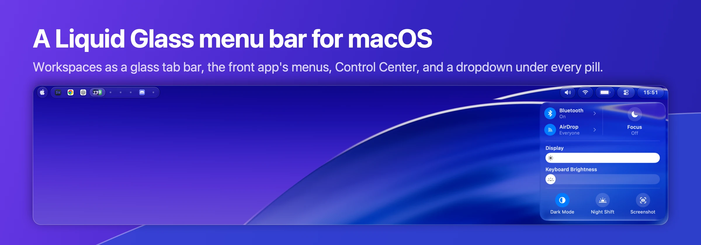
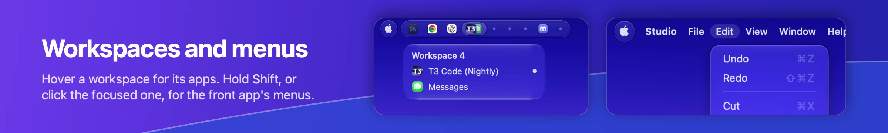
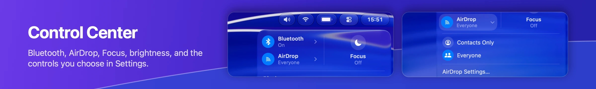
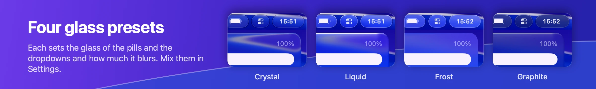
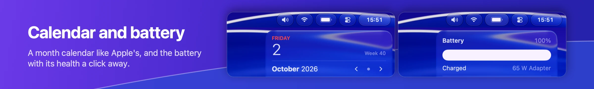
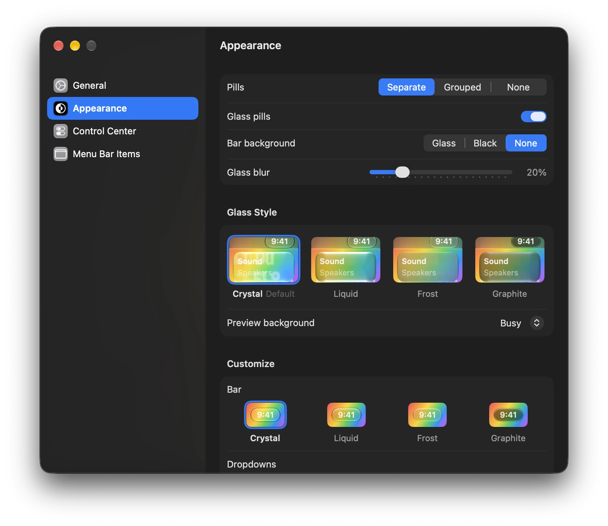

<p align="center">
  
</p>

LiquidBar replaces the macOS menu bar with one drawn in Liquid Glass. The left side shows your workspaces, from [AeroSpace](https://github.com/nikitabobko/AeroSpace), from macOS desktops, or as the running apps. The right side has volume, Wi-Fi, battery, Control Center, and the clock, each with a dropdown on hover. It is a native Swift and SwiftUI app with no config needed to start.

## What you get









Also in the bar:

- Now playing for Spotify and Music. On a new track the pill slides out to show the title.
- A Wi-Fi dropdown that lists the networks in range and joins them, and a Sound dropdown with a mute switch, the volume, and the output devices.
- Other apps' menu bar items, pinned to the bar from Settings.
- The Apple logo opens a dropdown with the Apple menu's items.
- A right-click anywhere along the top of the screen opens LiquidBar's menu: Check for Updates, Settings, and Quit.
- The native menu bar stays hidden while the bar runs. In a fullscreen app the bar hides like the native one and slides back when the pointer reaches the top edge.
- On first launch, three short tips with animated demos show the Shift menus, pinning, and the right-click menu.

## Install

With [Homebrew](https://brew.sh):

```sh
brew install --cask jbroma/tap/liquid-bar
```

Or download `LiquidBar-<version>.zip` from [Releases](https://github.com/jbroma/liquid-bar/releases), unzip it, and move `LiquidBar.app` to `/Applications`. Either way the app is signed with a Developer ID and notarized by Apple, so it opens like any other downloaded app.

A copy from Homebrew or from the zip updates itself. It checks for a new release once a day and asks before installing it. "Check for Updates…" in the bar's right-click menu checks right away, and Settings, General turns the daily check off. A copy installed with Nix leaves updates to your Nix configuration. [Updates](docs/details.md#releases-and-updates) has the details.

To start it at login, turn on **Open at login** in Settings, General.

To build from source instead, run `make install` (needs Xcode 26). It installs the app and a launch agent, which starts the bar at login and restarts it after a crash. [Building from source](docs/details.md#build-from-source) lists the other `make` targets.

## Requirements

- macOS 26 or later.
- Menu bar auto-hide off (System Settings, "Automatically hide and show the menu bar", Never). With auto-hide on, windows and notification banners can slide under the bar.
- Accessibility access, for the front app's menus, other apps' menu bar items, and a few Control Center tiles. The bar runs without it. On first launch it is the only thing the bar asks for; every other grant is asked for when you first use what needs it. Settings, General lists each grant with its live status. [Permissions](docs/details.md#permissions) lists every grant.
- [AeroSpace](https://github.com/nikitabobko/AeroSpace) is optional.

## Settings

Right-click the bar and choose **LiquidBar Settings…**, or open LiquidBar again while it runs. The Settings window has four sections. General holds Open at login, the workspace source, now playing, the battery percentage, the clock format, each permission's status, the config file, and the version. Appearance sets the pills as separate, grouped, or none, in real glass or flat, the bar's background, and how much the glass blurs. It picks the look from four presets with a live preview, and Customize sets the glass of the pills, the dropdowns, and the background apart. Control Center chooses the controls in the Control Center dropdown. Menu Bar Items pins other apps' menu bar items to the bar and reorders them by drag.

<p align="center">
  
</p>

Everything else, like widget order, click commands, and script widgets, lives in `~/.config/liquid-bar/config.json`. See [Configuration](docs/configuration.md).

## How it works

The bar uses private macOS frameworks (SkyLight, DisplayServices, CoreBrightness) where no public API exists. A macOS update can break one of those features, but the bar loads each one at runtime, so a missing framework costs that feature and never crashes the bar. While the bar runs, the native menu bar is invisible. If the bar quits, macOS brings the native menu bar back. [Details](docs/details.md) covers behavior, permissions, and migrating from SketchyBar.

## Contributing

Bugs and feature requests go to [Issues](https://github.com/jbroma/liquid-bar/issues/new/choose), which has a short form for each. Questions, ideas, and screenshots of your bar go to [Discussions](https://github.com/jbroma/liquid-bar/discussions).

Pull requests are welcome, from people and from coding agents. `make run` builds and opens the bar, and it needs no signing identity. `swift test` runs the unit tests. [AGENTS.md](AGENTS.md) has the build rules and the commit format, which matters because commit subjects become the release notes.

## License

MIT. See [LICENSE](LICENSE).
