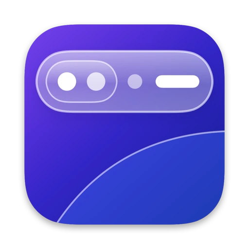
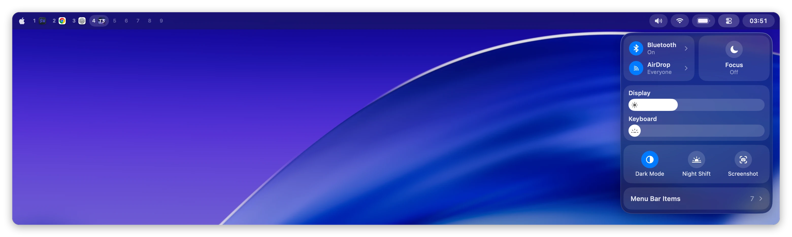
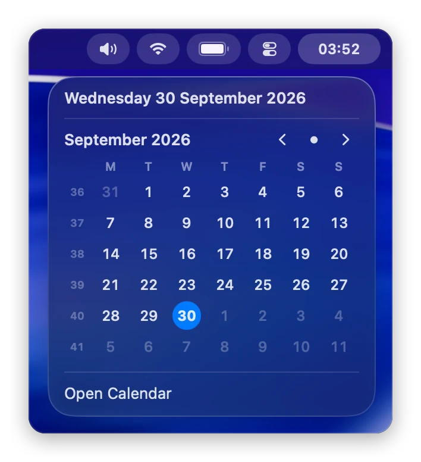
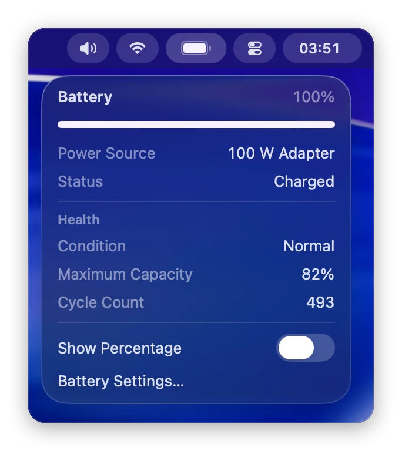
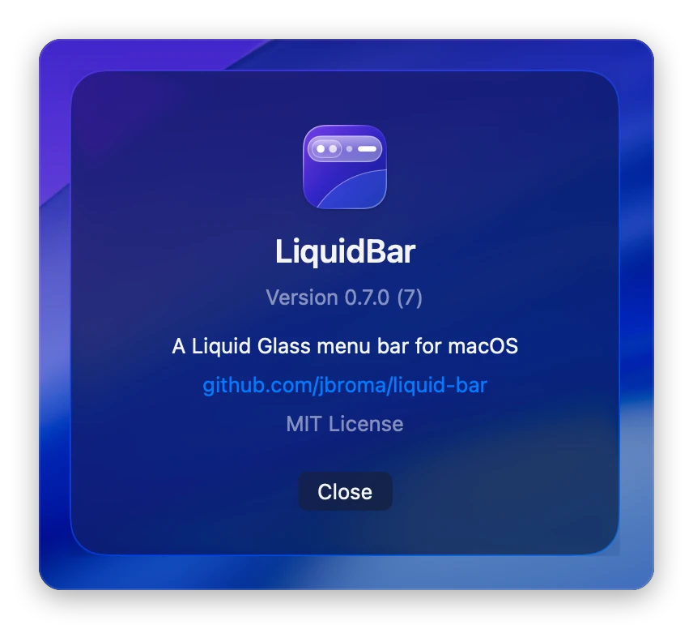
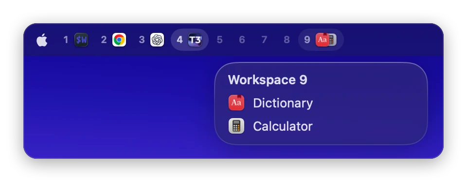

<p align="center">
  
</p>

<h1 align="center">liquid-bar</h1>

<p align="center">A macOS 26 menu bar replacement in Liquid Glass, with workspaces, Control Center, and a dropdown under every pill.</p>

<p align="center">
  
</p>

## What you get

- A glass bar with glass pills. Hover a pill and its dropdown floats below it.
- Workspaces with their apps' icons, from AeroSpace, the macOS desktops, or the running apps.
- The front app's menus when you click the focused workspace, or while you hold Shift with the pointer on the bar.
- Control Center, with the other apps' menu bar items listed inside it. Pin one and it moves onto the bar as its own pill, with the item's menu as its dropdown.
- Now playing for Spotify and Music. On a new track the pill slides out to show the title.
- The native menu bar stays hidden while the bar runs.
- The Apple logo opens a dropdown on hover with the Apple menu's items.
- A right-click on the bar opens LiquidBar's menu: Settings, About, and Quit.
- Six glass styles for the dropdowns and pills: Liquid, Dew, Crystal, Frost, Mist, and Obsidian.

<p align="center">
  
  
  
</p>
<p align="center">
  
</p>

## Install

Download `LiquidBar-<version>.zip` from [Releases](https://github.com/jbroma/liquid-bar/releases), unzip it, and move `LiquidBar.app` to `/Applications`. It is signed with a Developer ID and notarized by Apple, so it opens like any other downloaded app.

To start it at login, copy [`Support/dev.liquidbar.plist`](Support/dev.liquidbar.plist) to `~/Library/LaunchAgents/` and run:

```sh
launchctl bootstrap gui/$(id -u) ~/Library/LaunchAgents/dev.liquidbar.plist
```

To build from source instead, run `make install` (needs Xcode 26). It installs the app and the launch agent. [Building from source](docs/details.md#build-from-source) lists the other `make` targets.

## Requirements

- macOS 26 or later.
- Menu bar auto-hide off (System Settings, "Automatically hide and show the menu bar", Never). With auto-hide on, windows and notification banners can slide under the bar.
- Accessibility access, for the front app's menus, other apps' menu bar items, and a few Control Center tiles. The bar runs without it. On launch without the grant, the bar shows a window that opens the right Settings pane and notices the grant; the Open… button next to Accessibility in Settings, General reopens it. [Permissions](docs/details.md#permissions) lists every grant.
- [AeroSpace](https://github.com/nikitabobko/AeroSpace) is optional.

## Settings

Right-click the bar and choose **LiquidBar Settings…**, or open LiquidBar again while it runs. The Settings window has five sections. General holds the workspace source, now playing, the battery percentage, the clock format, and the Accessibility status. Appearance picks the glass style from five cards with a live preview. Menu Bar Items pins other apps' menu bar items to the bar and reorders them by drag. Advanced opens and reloads the config file. About shows the version and license.

<!-- Screenshot placeholder: the Settings window on its Appearance section, the five glass style cards with Liquid selected. -->

Everything else, like widget order, click commands, and script widgets, lives in `~/.config/liquid-bar/config.json`. See [Configuration](docs/configuration.md).

## How it works

The bar uses private macOS frameworks (SkyLight, DisplayServices, CoreBrightness) where no public API exists. A macOS update can break one of those features, but the bar loads each one at runtime, so a missing framework costs that feature and never crashes the bar. While the bar runs, the native menu bar is invisible. If the bar quits, macOS brings the native menu bar back. [Details](docs/details.md) covers behavior, permissions, and migrating from SketchyBar.

## License

MIT. See [LICENSE](LICENSE).
