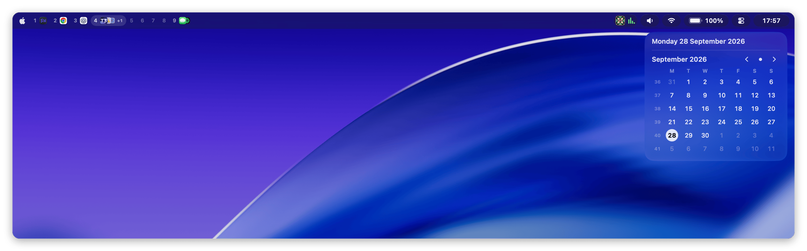
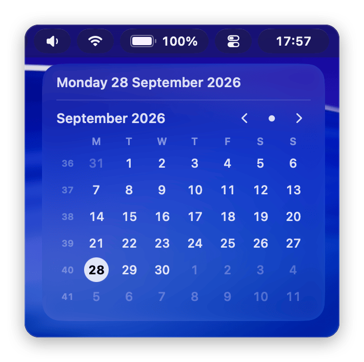
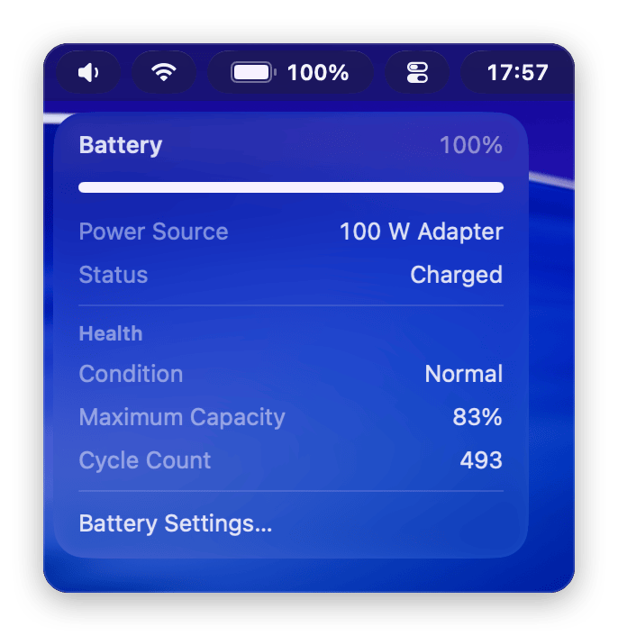
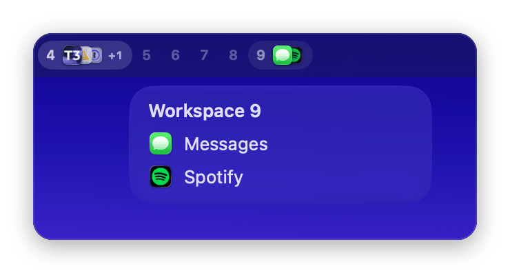
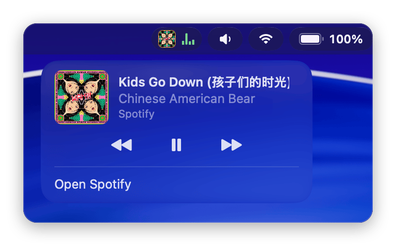
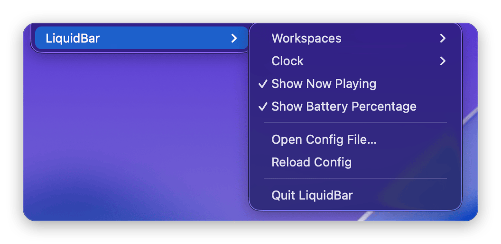

# liquid-bar

A macOS 26 menu bar replacement drawn in Liquid Glass.

<p align="center">
  
</p>

## What you get

- A glass bar with glass pills. Hover a pill and its dropdown floats below it.
- Workspaces with their apps' icons, from AeroSpace, the macOS desktops, or the running apps.
- The front app's menus when you click the focused workspace.
- Control Center, with the other apps' menu bar items listed inside it. Pin one and it moves onto the bar as its own pill, with the item's menu as its dropdown.
- Now playing for Spotify and Music. On a new track the pill slides out to show the title.
- The native menu bar stays hidden while the bar runs.
- A LiquidBar submenu in the Apple menu for settings.

<p align="center">
  
  
</p>
<p align="center">
  
  
</p>

## Install

Download `LiquidBar-<version>.zip` from [Releases](https://github.com/jbroma/liquid-bar/releases), unzip it, and move `LiquidBar.app` to `/Applications`. The app is signed but not notarized, so allow it once:

```sh
xattr -dr com.apple.quarantine /Applications/LiquidBar.app
```

To start it at login, copy [`Support/dev.liquidbar.plist`](Support/dev.liquidbar.plist) to `~/Library/LaunchAgents/` and run:

```sh
launchctl bootstrap gui/$(id -u) ~/Library/LaunchAgents/dev.liquidbar.plist
```

To build from source instead, run `make install` (needs Xcode 26). It installs the app and the launch agent. [Building from source](docs/details.md#build-from-source) lists the other `make` targets.

## Requirements

- macOS 26 or later.
- Menu bar auto-hide off (System Settings, "Automatically hide and show the menu bar", Never). With auto-hide on, windows and notification banners can slide under the bar.
- Accessibility access, for the front app's menus, other apps' menu bar items, and a few Control Center tiles. The bar runs without it. [Permissions](docs/details.md#permissions) lists every grant.
- [AeroSpace](https://github.com/nikitabobko/AeroSpace) is optional.

## Settings

Open the Apple menu and pick **LiquidBar** to switch the workspace source, the clock format, and whether now playing and the battery percentage show.

<p align="center">
  
</p>

Everything else, like widget order, click commands, and script widgets, lives in `~/.config/liquid-bar/config.json`. See [Configuration](docs/configuration.md).

## How it works

The bar uses private macOS frameworks (SkyLight, DisplayServices, CoreBrightness) where no public API exists. A macOS update can break one of those features, but the bar loads each one at runtime, so a missing framework costs that feature and never crashes the bar. While the bar runs, the native menu bar is invisible. If the bar quits, macOS brings the native menu bar back. [Details](docs/details.md) covers behavior, permissions, and migrating from SketchyBar.

## License

MIT. See [LICENSE](LICENSE).
