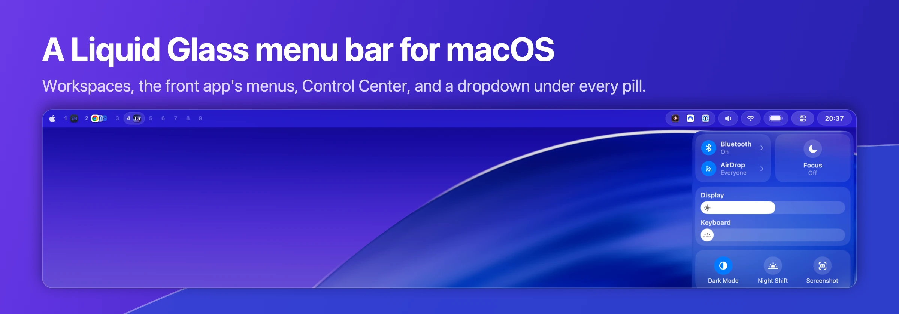
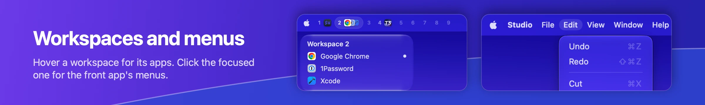
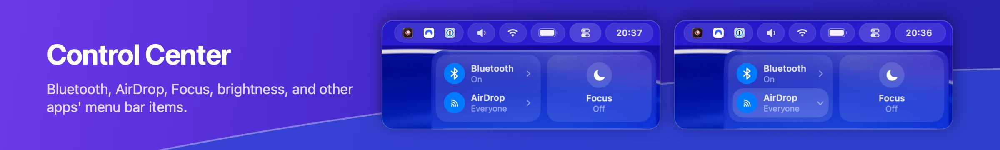
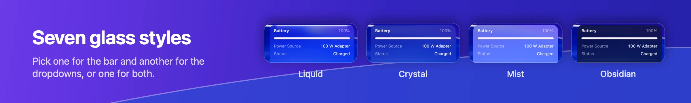
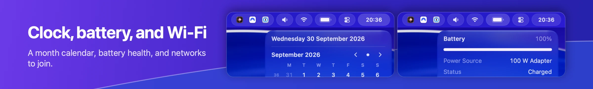
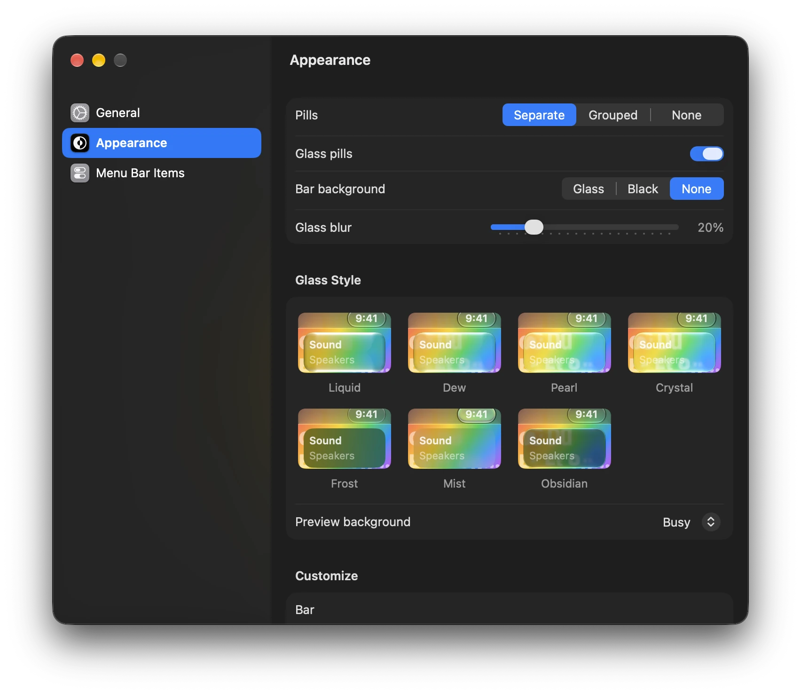

<p align="center">
  
</p>

## What you get









Also in the bar:

- Now playing for Spotify and Music. On a new track the pill slides out to show the title.
- The Apple logo opens a dropdown with the Apple menu's items.
- A right-click on the bar opens LiquidBar's menu: Settings and Quit.
- The native menu bar stays hidden while the bar runs.

## Install

Download `LiquidBar-<version>.zip` from [Releases](https://github.com/jbroma/liquid-bar/releases), unzip it, and move `LiquidBar.app` to `/Applications`. It is signed with a Developer ID and notarized by Apple, so it opens like any other downloaded app.

A downloaded copy updates itself. It checks for a new release once a day and asks before installing it. "Check for Updates…" in the bar's right-click menu checks right away, and Settings, General turns the daily check off. A copy installed with Nix leaves updates to your Nix configuration. [Updates](docs/details.md#releases-and-updates) has the details.

To start it at login, copy [`Support/dev.liquidbar.plist`](Support/dev.liquidbar.plist) to `~/Library/LaunchAgents/` and run:

```sh
launchctl bootstrap gui/$(id -u) ~/Library/LaunchAgents/dev.liquidbar.plist
```

To build from source instead, run `make install` (needs Xcode 26). It installs the app and the launch agent. [Building from source](docs/details.md#build-from-source) lists the other `make` targets.

## Requirements

- macOS 26 or later.
- Menu bar auto-hide off (System Settings, "Automatically hide and show the menu bar", Never). With auto-hide on, windows and notification banners can slide under the bar.
- Accessibility access, for the front app's menus, other apps' menu bar items, and a few Control Center tiles. The bar runs without it. On first launch it is the only thing the bar asks for; every other grant is asked for when you first use what needs it. Settings, General lists each grant with its live status. [Permissions](docs/details.md#permissions) lists every grant.
- [AeroSpace](https://github.com/nikitabobko/AeroSpace) is optional.

## Settings

Right-click the bar and choose **LiquidBar Settings…**, or open LiquidBar again while it runs. The Settings window has three sections. General holds the workspace source, now playing, the battery percentage, the clock format, each permission's status, the config file, and the version. Appearance sets the pills as separate, grouped, or none, in real glass or flat, the bar's background, and how much the glass blurs. It picks the look from four presets with a live preview, and Customize sets the glass of the pills, the dropdowns, and the background apart. Menu Bar Items pins other apps' menu bar items to the bar and reorders them by drag.

<p align="center">
  
</p>

Everything else, like widget order, click commands, and script widgets, lives in `~/.config/liquid-bar/config.json`. See [Configuration](docs/configuration.md).

## How it works

The bar uses private macOS frameworks (SkyLight, DisplayServices, CoreBrightness) where no public API exists. A macOS update can break one of those features, but the bar loads each one at runtime, so a missing framework costs that feature and never crashes the bar. While the bar runs, the native menu bar is invisible. If the bar quits, macOS brings the native menu bar back. [Details](docs/details.md) covers behavior, permissions, and migrating from SketchyBar.

## License

MIT. See [LICENSE](LICENSE).
